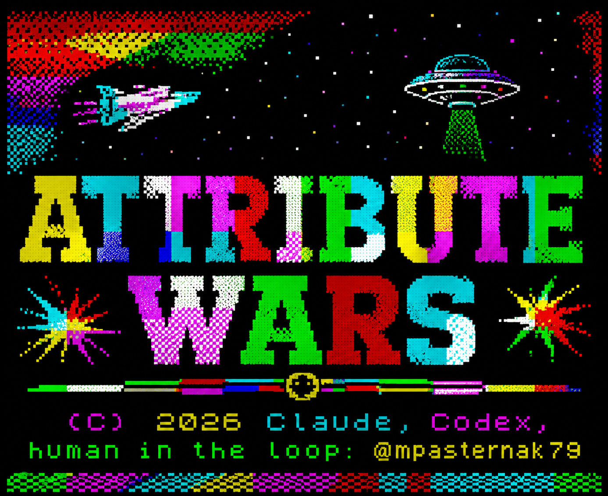

# Attribute Wars



**Attribute Wars** is a Geometry-Wars-style twin-joystick shooter for the
Timex/Spectrum family, written in C and hand-written Z80 assembly with
[z88dk](https://z88dk.org).

The game focuses on fast 50 Hz action: lots of movement, tight controls, simple
attribute-heavy visuals, and hardware page flipping where the machine supports it.

## Supported Machines

| Machine | Status | Video | Sound |
|---|---|---|---|
| Timex TC2048 | primary target | SCLD page flipping | beeper |
| Timex TC2068 / TS2068 | supported for AY testing | SCLD page flipping | AY music + FX |
| ZX Spectrum 128K | separate build | shadow-screen page flipping | beeper for now |
| ZX Spectrum 48K | separate build | single-buffer flicker | beeper |

## Build

Requires z88dk in `~/Programowanie/z88dk`.

```sh
./build.sh        # Timex TC2048/TC2068 build -> build/game.tap
./build-zx128.sh  # ZX Spectrum 128K build -> build/game-zx128.tap
./build-zx48.sh   # ZX Spectrum 48K build -> build/game-zx48.tap
```

The TAP files include the loading screen converted from the original
`assets/loading.png`.

## Run In ZEsarUX

```sh
./run-zesarux-tc2048.sh   # TC2048, beeper default
./run-zesarux-tc2068.sh   # TC2068, Timex AY
./run-zesarux-128k.sh     # ZX Spectrum 128K, shadow-screen page flip
./run-zesarux-48k.sh      # ZX Spectrum 48K, single-buffer flicker
```

`./run-zesarux.sh` is the default TC2048 launcher.

## Controls

Choose controls on the title screen:

- `1` Kempston move, keyboard fire
- `2` keyboard move, Kempston fire
- `3` two joysticks on TS2068/TC2068

Keyboard movement uses `5/6/7/8`. Keyboard fire uses `0` or the 8-way cluster
`Q W E / A D / Z X C`.

## Sound

The title screen has a SOUND menu:

- `4` BEEPER
- `5` MUSIC+FX
- `6` FX only

Music is **Spectrumizer** by Pator, [@paatorr](https://x.com/paatorr).

## Tests

```sh
./test/run.sh
```

## License

Code: [MIT](LICENSE) © 2026 Michał Pasternak.

The bundled PT3 tune is a third-party music asset and is not covered by the MIT
license.
